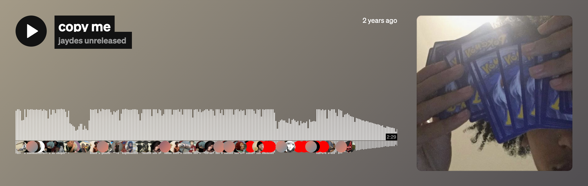

  
  <h1 align="center">Hi, I'm Marry</h1>

<h3 align="center">An incoming Amazon software engineer intern & current Yale University CS student from Metro Detroit</h3>

---
༶•┈┈୨♡୧┈┈•༶
### 🔬 What I’m Working On
- Open-weight LLM robustness & LoRA optimization
- ML systems for large-scale data validation
- High-performance C/C++ projects
- Building developer tools & startups

---
༶•┈┈୨♡୧┈┈•༶
### Tech Stack  
**Languages**  

**Frameworks & Tools**  

**Machine Learning**  

**Cloud**  

---
༶•┈┈୨♡୧┈┈•༶
### Connect With Me  
💻 **Website:** [marrykassa.com](http://marrykassa.com)  
📧 **Email:** [marry.kassa@yale.edu](mailto:marry.kassa@yale.edu)  
🌐 **LinkedIn:** [Marry Kassa](https://www.linkedin.com/in/marry-kassa/)  

---
༶•┈┈୨♡୧┈┈•༶
### Probably listening to..

